# Ocean Across DevOps Assignment

## Project Overview

This repository is a security-first infrastructure reference for a UK payroll
platform with separate Companies, Bureaus, and Employees portals. It contains
modular Terraform, a dependency-free placeholder API and container image, a
hardened GitHub Actions example, architecture decisions, monitoring controls,
and operational documentation.

The objective is to demonstrate well-structured infrastructure as code (IaC),
defence in depth, least privilege, and practical operational reasoning. It is
not a production accreditation and contains no real payroll processing logic or
customer data.

> **Deployment status:** Live AWS deployment is optional for this assignment.
> This repository contains reviewable IaC and deployment examples, but no
> Terraform state, AWS resource identifiers, apply output, or other evidence is
> committed that would prove the resources have been deployed. References to
> resources below describe the intended configuration unless explicitly stated
> otherwise.

| Deliverable | Repository status |
| --- | --- |
| AWS infrastructure | Implemented as modular Terraform and suitable for static review and planning |
| Placeholder backend | Implemented in Python with `/health` and `/portal` endpoints, unit tests, and a non-root Docker image |
| CI/CD | Build/test workflow implemented; SSM deployment is manual, disabled by default, and dependent on external controls listed below |
| Architecture and operations | ADR, Mermaid diagram, multi-tenancy design, security controls, incident runbook, and UK GDPR considerations included |
| AI usage log | Exact recorded prompts are in `ai_log.md`; author-review placeholders must be completed before submission |
| Live AWS environment | Not asserted and not required to evaluate the repository |

### Contents

- [Threat and Security Context](#threat-and-security-context)
- [Architecture Summary](#architecture-summary)
- [Repository Structure](#repository-structure)
- [Terraform Setup](#terraform-setup)
- [CI/CD Setup](#cicd-setup)
- [Multi-Tenancy Architecture](#multi-tenancy-architecture)
- [Security Controls](#security-controls)
- [Monitoring and Incident Readiness](#monitoring-and-incident-readiness)
- [Incident Response Runbook](#incident-response-runbook-public-rds-postgresql)
- [UK GDPR Compliance Considerations](#uk-gdpr-compliance-considerations)
- [Trade-offs and Production Improvements](#trade-offs-and-production-improvements)
- [Cleanup](#cleanup)

## Threat and Security Context

Payroll records, employee identity data, bank details, employer records, tax
data, documents, credentials, and audit evidence are confidential assets. The
design assumes internet-originated requests, accidental operator changes,
compromised application processes, defective tenant authorization, stolen CI
credentials, malicious uploads, and attempted lateral movement between portals.

The principal security objectives are:

- Prevent public access to EC2, RDS, S3 documents, and secrets.
- Prevent one portal process from assuming another portal's AWS permissions.
- Prevent one customer or employee from accessing another tenant's rows or
  objects, including when an application query omits a tenant predicate.
- Keep credentials out of Git, Terraform inputs, EC2 user data, Docker images,
  GitHub logs, and application logs.
- Encrypt sensitive data in transit and at rest, retain only what has a defined
  purpose, and preserve sufficient evidence for detection and response.
- Make production changes attributable, reviewable, reversible, and constrained
  to the intended environment and target.

The design uses independent controls at the identity, network, compute,
database, object-storage, delivery, and monitoring layers. No single AWS control
is treated as sufficient: security groups do not replace PostgreSQL Row-Level
Security (RLS), S3 prefixes do not replace application authorization, and
encryption does not replace access control or data minimisation.

## Architecture Summary

The proposed primary region is AWS London (`eu-west-2`). One VPC spans at least
two Availability Zones and separates public ingress placeholders, private portal
subnets, and private database subnets. Three EC2 instances and instance roles
isolate Companies, Bureaus, and Employees at the compute and IAM layers. A
private, encrypted PostgreSQL instance serves the pooled tenant model, while a
private, versioned S3 bucket separates portal object namespaces. CloudWatch and
SNS provide the assignment monitoring baseline.

The public subnets contain no workload today. Private route tables have no
default route to the Internet Gateway and no NAT Gateway, so the design is
cost-conscious but intentionally incomplete for live administration and package
installation. VPC endpoints or another controlled egress design are required
before SSM, S3, CloudWatch, Secrets Manager, Parameter Store, and package
repositories can be reached from private instances.

```mermaid
flowchart TB
  company_users["Company users"]
  bureau_users["Bureau users"]
  employee_users["Employee users"]
  github["GitHub Actions<br/>Build and test"]

  subgraph aws["AWS eu-west-2 (London)"]
    direction TB

    subgraph vpc["VPC 10.20.0.0/16 - network security boundary"]
      direction TB

      igw["Internet Gateway"]

      subgraph public_tier["PUBLIC TIER - internet route, no application EC2"]
        direction LR
        public_a["Public subnet<br/>Availability Zone A"]
        public_b["Public subnet<br/>Availability Zone B"]
        ingress["Future HTTPS load balancer<br/>not provisioned"]
        public_a --- ingress
        public_b --- ingress
      end

      subgraph app_tier["PRIVATE APPLICATION TIER - no IGW or NAT route"]
        direction LR

        subgraph bureau_boundary["BUREAU boundary<br/>Private subnet + NACL + Bureau SG - AZ A"]
          bureau_ec2["Bureau Portal EC2<br/>isolated instance"]
        end

        subgraph employee_boundary["EMPLOYEE boundary<br/>Private subnet + NACL + Employee SG - AZ A"]
          employee_ec2["Employee Portal EC2<br/>isolated instance"]
        end

        subgraph company_boundary["COMPANY boundary<br/>Private subnet + NACL + Company SG - AZ B"]
          company_ec2["Company Portal EC2<br/>isolated instance"]
        end
      end

      subgraph database_tier["PRIVATE DATABASE TIER - no public route"]
        direction LR
        database_a["DB subnet<br/>Availability Zone A"]
        rds["RDS PostgreSQL<br/>Single-AZ instance<br/>encrypted, TLS<br/>PubliclyAccessible = false<br/>RDS SG: app SGs only"]
        database_b["DB subnet<br/>Availability Zone B"]
        database_a --- rds
        database_b --- rds
      end

      igw --> public_a
      igw --> public_b
      ingress -.->|"Company Portal HTTPS"| company_ec2
      ingress -.->|"Bureau Portal HTTPS"| bureau_ec2
      ingress -.->|"Employee Portal HTTPS"| employee_ec2

      company_ec2 -->|"TLS 5432<br/>Company SG source"| rds
      bureau_ec2 -->|"TLS 5432<br/>Bureau SG source"| rds
      employee_ec2 -->|"TLS 5432<br/>Employee SG source"| rds
    end

    subgraph iam["IAM portal boundaries"]
      direction LR
      company_role["Company EC2 role"]
      bureau_role["Bureau EC2 role"]
      employee_role["Employee EC2 role"]
      deploy_roles["Service-specific OIDC roles<br/>required; not provisioned"]
    end

    subgraph storage["Private encrypted S3 payroll bucket - Block Public Access"]
      direction LR
      company_prefix["companies/{company_id}/*"]
      bureau_prefix["bureaus/{bureau_id}/*"]
      employee_prefix["employees/{company_id}/{employee_id}/*"]
    end

    artifact_bucket["Separate private S3<br/>deployment-artifact bucket<br/>required for live deployment"]

    subgraph config["Secrets and systems management"]
      direction LR
      secrets["Secrets Manager<br/>RDS-managed master secret"]
      parameters["SSM Parameter Store<br/>portal-specific paths"]
      run_command["Systems Manager<br/>Run Command"]
    end

    subgraph observability["Monitoring and incident notification"]
      direction LR
      cloudwatch["CloudWatch<br/>per-portal logs<br/>EC2 CPU + RDS connection alarms"]
      sns["SNS critical alerts<br/>optional confirmed email"]
      cloudwatch -->|"ALARM and OK"| sns
    end
  end

  company_users -.->|"Company Portal"| ingress
  bureau_users -.->|"Bureau Portal"| ingress
  employee_users -.->|"Employee Portal"| ingress

  company_role -.->|"Instance profile"| company_ec2
  bureau_role -.->|"Instance profile"| bureau_ec2
  employee_role -.->|"Instance profile"| employee_ec2

  company_role -->|"Only companies/*"| company_prefix
  bureau_role -->|"Only bureaus/*"| bureau_prefix
  employee_role -->|"Only employees/*"| employee_prefix

  company_role -->|"Only /payroll/env/companies/*"| parameters
  bureau_role -->|"Only /payroll/env/bureaus/*"| parameters
  employee_role -->|"Only /payroll/env/employees/*"| parameters
  rds -.->|"Managed credential"| secrets

  company_ec2 -->|"Application logs + CPU"| cloudwatch
  bureau_ec2 -->|"Application logs + CPU"| cloudwatch
  employee_ec2 -->|"Application logs + CPU"| cloudwatch
  rds -->|"DatabaseConnections"| cloudwatch

  github -->|"GitHub OIDC"| deploy_roles
  github -.->|"Tested image archive"| artifact_bucket
  deploy_roles -.->|"SSM SendCommand<br/>exact tagged target"| run_command
  run_command -.-> company_ec2
  run_command -.-> bureau_ec2
  run_command -.-> employee_ec2
  company_ec2 -.->|"Service-prefix read"| artifact_bucket
  bureau_ec2 -.->|"Service-prefix read"| artifact_bucket
  employee_ec2 -.->|"Service-prefix read"| artifact_bucket

  classDef user fill:#ffffff,stroke:#475569,color:#0f172a;
  classDef public fill:#fff7ed,stroke:#c2410c,color:#7c2d12;
  classDef private fill:#eff6ff,stroke:#1d4ed8,color:#1e3a8a;
  classDef database fill:#fef2f2,stroke:#b91c1c,color:#7f1d1d;
  classDef managed fill:#faf5ff,stroke:#7e22ce,color:#581c87;
  classDef identity fill:#f0fdf4,stroke:#15803d,color:#14532d;

  class company_users,bureau_users,employee_users,github user;
  class igw,public_a,public_b,ingress public;
  class company_ec2,bureau_ec2,employee_ec2 private;
  class database_a,database_b,rds database;
  class company_role,bureau_role,employee_role,deploy_roles identity;
  class company_prefix,bureau_prefix,employee_prefix,artifact_bucket,secrets,parameters,run_command,cloudwatch,sns managed;

  style vpc fill:#f8fafc,stroke:#334155,stroke-width:3px
  style public_tier fill:#fffaf0,stroke:#c2410c,stroke-width:2px
  style app_tier fill:#f8fbff,stroke:#1d4ed8,stroke-width:2px
  style database_tier fill:#fffafa,stroke:#b91c1c,stroke-width:2px
  style company_boundary fill:#eff6ff,stroke:#2563eb,stroke-width:3px
  style bureau_boundary fill:#f0f9ff,stroke:#0369a1,stroke-width:3px
  style employee_boundary fill:#eef2ff,stroke:#4338ca,stroke-width:3px
  style storage fill:#faf5ff,stroke:#7e22ce,stroke-width:2px
  style iam fill:#f0fdf4,stroke:#15803d,stroke-width:2px
```



Solid arrows show configured logical access relationships, not proof of live
network reachability. Dashed ingress and CI/CD arrows show intended components:
the public subnets currently contain no load balancer, and private EC2 access to
SSM, S3, Parameter Store, Secrets Manager, and CloudWatch requires the matching
VPC endpoints or other controlled egress. The S3 IAM boundary separates portal
prefixes; customer isolation within a portal still depends on authenticated
object keys and application authorization.

For the rationale behind these choices, see
[`ADR-0001-security-first-aws-architecture.md`](docs/decisions/ADR-0001-security-first-aws-architecture.md).

## Repository Structure

```text
.
|-- .github/workflows/deploy.yml       # Build, test, and SSM deployment example
|-- .gitignore                         # Excludes state, plans, secrets, and local artefacts
|-- app/
|   |-- Dockerfile                     # Non-root placeholder API image
|   |-- src/app.py                     # /health and /portal endpoints
|   `-- tests/test_app.py              # Standard-library unit tests
|-- docs/
|   |-- GITHUB_ACTIONS_SECURITY_AUDIT.md
|   `-- decisions/
|       `-- ADR-0001-security-first-aws-architecture.md
|-- infrastructure/terraform/
|   |-- .terraform.lock.hcl             # Reviewed provider selection and checksums
|   |-- main.tf                        # Root module composition and provider
|   |-- variables.tf                   # Typed and validated inputs
|   |-- outputs.tf                     # Non-secret IDs plus sensitive RDS outputs
|   |-- versions.tf                    # Terraform and AWS provider constraints
|   |-- terraform.tfvars.example       # Reviewable non-secret example values
|   `-- modules/
|       |-- compute/                    # Three private EC2 portal hosts
|       |-- database/                   # Private encrypted RDS PostgreSQL
|       |-- iam/                        # Per-portal roles and S3 bucket policy
|       |-- monitoring/                 # Log groups, alarms, SNS topic
|       |-- networking/                 # VPC, subnets, routes, Internet Gateway
|       |-- security/                   # Security groups and NACLs
|       `-- storage/                    # Private encrypted versioned S3 bucket
|-- AI_USAGE_LOG.md                    # Original detailed interaction record
|-- ai_log.md                          # Submission-format AI interaction log
|-- Ocean Across DevOps Assignment.pdf # Source assignment brief
`-- README.md
```

Terraform state, plan files, local variable files, environment files, keys, and
Python build artefacts are excluded by `.gitignore`. The example variable file
must remain free of credentials and application secrets.

## Terraform Setup

### Prerequisites

- Terraform `>= 1.6.0, < 2.0.0`.
- AWS provider `>= 5.0.0, < 7.0.0` (downloaded by `terraform init`).
- AWS CLI v2 for the identity checks shown below.
- An AWS account and a least-privilege operator identity only when running
  `terraform plan` against AWS data sources or applying resources.
- AWS credentials from the standard provider chain, preferably AWS IAM Identity
  Center/SSO or another short-lived session. Do not place access keys in `.tf`,
  `.tfvars`, shell history, or the repository.

Creating resources can incur charges. Free Tier eligibility varies by account,
service, region, and date; review the current plan and AWS pricing before an
optional apply.

### Validate and plan

```bash
cd infrastructure/terraform
terraform fmt -check -recursive
terraform init
terraform validate
cp terraform.tfvars.example terraform.tfvars
```

Review `terraform.tfvars` before continuing. Keep `aws_region = "eu-west-2"`
for the documented UK residency boundary, leave `ssh_allowed_cidr = null`, and
use `rds_deletion_protection = false` only for disposable assignment testing.
The file is ignored by Git.

Authenticate without hardcoded credentials, for example through an existing SSO
profile, then generate and inspect a plan:

```bash
export AWS_PROFILE=ocean-across-dev
aws sts get-caller-identity
terraform plan -out=assignment.tfplan
terraform show assignment.tfplan
```

Planning queries AWS for Availability Zones, account identity, and optionally
the latest Amazon Linux AMI. Set `ec2_ami_id` to an approved regional AMI for a
reproducible live environment. Treat saved plan files as sensitive because they
can contain infrastructure metadata.

Applying is optional and must happen only after the target account, region,
cost, security changes, and plan have been reviewed:

```bash
terraform apply assignment.tfplan
```

Useful outputs include portal instance IDs and private IPs, subnet and security
group IDs, alarm names, the SNS topic ARN, and the generated S3 bucket name. RDS
endpoint and managed-secret ARN outputs are marked sensitive; do not publish
them in CI logs or assignment evidence.

### State handling

This assessment does not configure a remote backend, so Terraform uses local
state by default. Local state is excluded from Git but still contains sensitive
infrastructure metadata. A team or production deployment must use a separately
bootstrapped, encrypted, versioned remote backend in the approved region with
state locking, narrowly scoped access, audit logging, backup, and recovery
procedures. Never commit or casually share state.

## CI/CD Setup

The workflow at [`.github/workflows/deploy.yml`](.github/workflows/deploy.yml)
checks Terraform formatting and validation, runs unit tests, builds a Docker
image, and smoke-tests `/health` and `/portal` on pushes to `main` and manual
dispatches. It packages and deploys an image only
when a manual run explicitly sets `perform_deployment = true`. The optional job
then verifies the bundle digest, requests short-lived AWS credentials using
GitHub OIDC, uploads an encrypted artifact, and invokes SSM on an exact tagged
instance. No long-lived AWS credential is stored in the YAML.

Local application checks use only Python and Docker:

```bash
python -m unittest discover -s app/tests -v
docker build --tag ocean-across-placeholder:local app
docker run --rm --read-only --cap-drop ALL \
  --publish 127.0.0.1:8080:8080 \
  --env PORTAL_TYPE=companies \
  ocean-across-placeholder:local
curl --fail http://127.0.0.1:8080/health
curl --fail http://127.0.0.1:8080/portal
```

### Required GitHub configuration

Create protected GitHub Environments named `dev` and `production`. Production
should require independent approval, prevent self-review and administrator
bypass, and accept deployments only from protected `main`. Set the following as
environment **variables**, not source-controlled values:

| Variable | Purpose |
| --- | --- |
| `AWS_REGION` | Must be `eu-west-2` |
| `DEPLOYMENT_BUCKET` | Dedicated private deployment-artifact bucket, never the payroll bucket |
| `FRONTEND_INSTANCE_ID`, `BACKEND_INSTANCE_ID`, `AI_INSTANCE_ID` | Exact service deployment targets |
| `FRONTEND_DEPLOY_ROLE_ARN`, `BACKEND_DEPLOY_ROLE_ARN`, `AI_DEPLOY_ROLE_ARN` | Separate GitHub OIDC deployment roles |
| `PRODUCTION_DEPLOYMENTS_ENABLED` | Additional production kill switch; set to `true` only after approval |

The OIDC trust policies must constrain audience, repository, workflow, branch or
GitHub Environment, and each base role must be least privilege. Runtime secrets
remain in the service's scoped Secrets Manager or Parameter Store path and are
read by the application instance role, not by GitHub Actions. If any unrelated
third-party credential is later required, store it as a protected GitHub
Environment secret and avoid passing it to untrusted steps.

### Live deployment dependencies and limitations

The optional deployment job is not a proven live delivery path. Keep
`perform_deployment = false` until all of the following are provisioned and
verified:

- A dedicated, encrypted, versioned, TLS-only artifact bucket with public access
  blocked and service-prefix read permissions for the intended EC2 roles.
- GitHub's OIDC provider and three narrowly scoped deployment roles.
- SSM, SSM Messages, EC2 Messages, and Secrets Manager/Parameter Store interface
  endpoints, an S3 gateway endpoint, CloudWatch connectivity, and any controlled
  package/image egress required by the private instances.
- A pre-baked AMI or reachable package source. Current user data attempts
  `dnf install docker`, which cannot succeed in the no-NAT topology by itself.
- A resolved target model. Terraform creates Companies, Bureaus, and Employees
  hosts, while the assignment workflow selects Frontend, Backend, and AI. It
  intentionally fails closed on a tag mismatch; do not invent a mapping in
  production without documenting and implementing it.

Pushes to `main` build and test the placeholder only; they do not deploy. Manual
runs select one service and `dev` or `production`, and deployment requires the
explicit boolean opt-in. Production additionally requires protected `main`, an
exact `deploy-production` confirmation, the environment gate, and the enable
flag. Service/environment concurrency groups prevent two runs from modifying
the same target simultaneously. See
[`GITHUB_ACTIONS_SECURITY_AUDIT.md`](docs/GITHUB_ACTIONS_SECURITY_AUDIT.md) for
the threat review and residual risks.

## Multi-Tenancy Architecture

### Tenancy model

The assignment uses a **pooled database and shared schema** with an immutable
tenant key on every tenant-owned row. A Company is the primary payroll data
tenant. Bureaus are delegated tenants that may act for explicitly assigned
Companies, and Employees are identities scoped to their employer and their own
employee record.

| Portal | Authoritative request context | Permitted scope |
| --- | --- | --- |
| Companies | `user_id`, `company_id` | The authenticated user's Company memberships and permissions |
| Bureaus | `user_id`, `bureau_id`, `acting_company_id` | Companies with an active bureau-to-company assignment |
| Employees | `user_id`, `company_id`, `employee_id` | The authenticated employee's own permitted payroll data |

This model is appropriate for the assignment because one small RDS instance can
serve all portals, migrations remain centralized, and onboarding does not create
database infrastructure per customer. It depends on consistent application
authorization and PostgreSQL Row-Level Security (RLS), so it has a larger shared
blast radius than database-per-tenant isolation.

The three EC2 instances isolate **portal classes**, not individual customers. A
Companies instance compromise must not grant an Employees or Bureaus AWS role,
but its instance role currently covers all Companies tenants. Customer-level
isolation therefore remains mandatory in the API, PostgreSQL, and S3 object-key
design.

### Establishing tenant context at login

Tenant context is derived from trusted server-side records, never from a tenant
identifier supplied by the login form:

1. The identity service authenticates the user and verifies account state and
   MFA requirements.
2. The backend loads the user's active portal membership from the database.
3. A Company user receives only an active Company membership. An Employee is
   bound to one `company_id` and `employee_id`. A Bureau user must choose from
   Companies present in the authoritative, effective-dated assignment table.
4. If a Bureau changes the Company it is acting for, the backend rechecks the
   assignment and issues a new short-lived session. It does not accept an
   arbitrary Company ID as proof of access.
5. The signed session contains the subject, portal type, acting tenant ID,
   authorization version, audience, issuer, expiry, and token ID. It contains no
   bank details, payroll values, or unnecessary employee data.

Disabled memberships, revoked bureau assignments, and stale authorization
versions fail closed. Sensitive payroll or bank-detail operations should require
recent authentication or step-up MFA.

### Propagating context through API requests

The client sends the signed session using an `Authorization: Bearer` header or a
`Secure`, `HttpOnly`, and appropriate `SameSite` cookie. Middleware performs the
following work before a controller or repository is called:

1. Verify signature, issuer, audience, expiry, portal type, and revocation state.
2. Resolve the immutable request context from verified claims and current
   membership data.
3. Reject client-controlled `X-Tenant-ID`, query-string, or request-body tenant
   values as authorization evidence.
4. Start a database transaction and set transaction-local tenant context with a
   parameterized `set_config` call.
5. Pass a typed, immutable context object through the service layer and include
   the tenant predicate in every tenant-owned query.
6. Commit or roll back the transaction before returning the connection to the
   pool. Transaction-local settings must never leak to another request.

Tokens, session cookies, bank data, and payroll payloads must not be written to
application or audit logs.

### Unsafe and safe tenant-scoped queries

In these examples, `tenant_id` is the immutable Company UUID used as the payroll
data partition key. A domain-facing API may call it `company_id`, but the value
and database boundary must be unambiguous and consistent.

The following query is **unsafe even though it is parameterized**:

```typescript
return database.query(
  `SELECT payroll_record_id, employee_id, pay_period, gross_amount, net_amount
     FROM payroll_records
    WHERE payroll_record_id = $1::uuid`,
  [request.params.payrollRecordId],
);
```

It prevents this parameter from becoming SQL syntax, but it has no tenant
predicate. A user who obtains another record UUID through a log, support ticket,
browser history, or separate defect could retrieve another Company's payroll
record. A UUID is an identifier, not an authorization control.

The corrected version gets `tenantId` from verified request context, sets the RLS
context, and executes an explicit tenant-scoped query on the same transaction and
connection. Every value is a parameter; string concatenation is prohibited.

```typescript
await database.transaction(async (tx) => {
  await tx.query(
    "SELECT set_config('app.tenant_id', $1, true)",
    [requestContext.tenantId],
  );

  return tx.query(
    `SELECT payroll_record_id, employee_id, pay_period, gross_amount, net_amount
       FROM payroll_records
      WHERE tenant_id = $1::uuid
        AND payroll_record_id = $2::uuid`,
    [requestContext.tenantId, payrollRecordId],
  );
});
```

The explicit `tenant_id` predicate is retained even when RLS is enabled. It
documents intent, improves query planning, and provides another check against a
wrong request context. The tenant ID comes from verified middleware, not from
the request payload.

Application `WHERE` clauses are necessary, but they are not sufficient as the
only payroll isolation control:

- One missed predicate in a new endpoint, report, join, background job, or bulk
  export can expose many employees at once.
- A later refactor can weaken a predicate with incorrect `OR` logic or apply it
  to one joined table but not another.
- `INSERT` and `UPDATE` paths also need to prevent writing a different tenant ID;
  a read-only convention does not protect them.
- Application tests and reviews reduce mistakes but cannot make every future
  query correct, and a compromised application process already runs inside that
  trust boundary.

Payroll records and bank details have too much impact for isolation to depend on
a coding convention alone. RLS makes PostgreSQL evaluate a separate policy for
every affected row, including queries whose application-level predicate is
missing.

### PostgreSQL Row-Level Security

RLS provides a database-enforced, default-deny boundary when an application
query accidentally omits its tenant predicate. A representative policy is:

```sql
ALTER TABLE payroll_records ENABLE ROW LEVEL SECURITY;
ALTER TABLE payroll_records FORCE ROW LEVEL SECURITY;

CREATE POLICY payroll_company_isolation
ON payroll_records
FOR ALL
TO payroll_runtime
USING (
  tenant_id = NULLIF(current_setting('app.tenant_id', true), '')::uuid
)
WITH CHECK (
  tenant_id = NULLIF(current_setting('app.tenant_id', true), '')::uuid
);
```

If `app.tenant_id` is absent, the expression does not evaluate to `true`, so no
row is visible or writable. `USING` protects reads, updates, and deletes;
`WITH CHECK` prevents inserting a row for another tenant. Employee policies also
match `employee_id`. Bureau access additionally requires an active row in the
bureau-to-company assignment table for the selected `bureau_id` and Company.

Runtime roles must not own tenant tables and must not have `SUPERUSER` or
`BYPASSRLS`; schema migrations use a separate role unavailable to the
application. PostgreSQL documents that superusers, `BYPASSRLS` roles, and
normally table owners can bypass RLS, while `FORCE ROW LEVEL SECURITY` subjects
the owner to policies in normal operation. See the
[PostgreSQL RLS documentation](https://www.postgresql.org/docs/current/ddl-rowsecurity.html).

RLS is defense in depth, not a substitute for parameterized SQL. A successful
SQL-injection attacker using a role that can change custom session settings may
attempt to change `app.tenant_id`; preventing injection, minimizing database
privileges, and testing negative cross-tenant cases remain mandatory.

### IAM and S3 boundaries

Each portal EC2 instance has a separate IAM role. The Companies role can access
only `companies/*`, Bureaus only `bureaus/*`, and Employees only `employees/*`.
Bucket-policy denies reinforce those identity policies, and public access is
blocked. The application generates keys from authenticated context using:

```text
companies/<company_id>/...
bureaus/<bureau_id>/...
employees/<company_id>/<employee_id>/...
```

This is an independent boundary between portal classes if routing or application
authorization fails. It also prevents a compromised Employees process from
reading Company or Bureau objects with its own instance credentials.

The current EC2 roles are deliberately **not** per-customer roles: the Companies
role can access every object below `companies/`. Nested prefixes organize tenant
objects but do not by themselves enforce Company A versus Company B access.
Production should evaluate trusted STS session tags, per-tenant S3 access points,
separate roles or buckets for high-risk tenants, and customer-managed KMS keys.

### Onboarding

Onboarding is an authorized workflow, not a direct insert from a public request.
Every step records the approving actor, time, tenant identifier, and outcome
without copying payroll or bank data into the audit event.

**New Company**

1. Verify the contract, controller/processor responsibilities, lawful purpose,
   residency requirements, retention schedule, and required security review.
2. Create a random immutable `company_id`, Company record, baseline settings,
   and first administrator membership in one transaction.
3. Send a single-use, short-lived administrator invitation and require MFA
   before payroll or bank permissions are granted.
4. Reserve the virtual S3 namespace `companies/<company_id>/`; object keys are
   generated only by the backend.
5. Run negative authorization tests proving another Company, an unassigned
   Bureau, and an unrelated Employee receive no rows or objects.

**New Bureau**

1. Create an immutable `bureau_id`, Bureau record, and restricted administrator
   invitation. No Company access exists by default.
2. Create each bureau-to-company assignment only after Company approval. Store
   permitted actions, effective dates, approvers, and revocation state.
3. Reserve `bureaus/<bureau_id>/` for Bureau-owned documents. Company payroll
   documents are accessed only through an authorized service workflow, never by
   granting the Bureau role all of `companies/*`.
4. Test that the Bureau can act only for assigned Companies and loses access
   immediately when an assignment expires or is revoked.

The pooled model does not create a new EC2 instance, database, or AWS role for
each Company or Bureau. That keeps onboarding feasible but retains the shared
infrastructure trade-off.

### Offboarding and erasure

Access revocation is immediate; deletion follows an approved retention and
legal-hold decision. Company offboarding also disables its Employee memberships
and Bureau assignments. Bureau offboarding revokes delegated assignments but
does not delete payroll data owned by its Companies.

1. Disable users, API clients, invitations, and assignments; invalidate active
   sessions and rotate tenant-specific credentials or integration secrets.
2. Stop new processing and produce an authorized export or return manifest when
   contractually required. Record checksums and recipient approval, not file
   contents, in the audit trail.
3. Classify data by purpose, statutory retention, litigation hold, and data
   subject request. UK PAYE records generally must be retained for three years
   from the end of the relevant tax year, according to
   [GOV.UK payroll record guidance](https://www.gov.uk/paye-for-employers/keeping-records).
   The final schedule must be approved by the controller's legal or data
   protection owner because other records can have different obligations.
4. Move retained records into a logically closed state with no portal access and
   tightly restricted administrative retrieval. Retention is not permission for
   continued product use.
5. At expiry, delete tenant rows in dependency order and remove every S3 object
   version and delete marker. A delete marker in a versioned bucket is not proof
   of erasure. Automated RDS backups age out under the documented schedule, and
   manual snapshots are deleted when their approved legal basis ends. Until then,
   backup access remains exceptional and restricted. Any restore process must
   reapply deletion tombstones before the database can serve production traffic,
   so an offboarded tenant is not silently resurrected.
6. Verify that tenant logins fail, bureau assignments are inactive, RLS queries
   return no data, S3 version listings are empty, and downstream recipients have
   been notified where required.
7. Retain a minimal, append-only, access-controlled audit record containing
   request and approval IDs, legal basis, data categories, timestamps, deletion
   job results, backup-expiry date, and verification outcome. It must not
   preserve the deleted payroll payload or reusable credentials.

UK GDPR storage limitation requires review and deletion or anonymisation when
personal data is no longer needed; the right to erasure is not absolute where a
legal obligation or legal claim requires retention. See the ICO guidance on
[storage limitation](https://ico.org.uk/for-organisations/uk-gdpr-guidance-and-resources/data-protection-principles/a-guide-to-the-data-protection-principles/storage-limitation/)
and the [right to erasure](https://ico.org.uk/for-organisations/uk-gdpr-guidance-and-resources/individual-rights/individual-rights/right-to-erasure/).

### Multi-tenancy trade-offs

- A shared schema is inexpensive and operationally simple, but one policy or
  privileged-role error can affect many tenants and tenants share capacity.
- RLS catches missing tenant predicates, but it must be forced, tested for every
  tenant-owned table, and used through non-owner runtime roles.
- Short-lived tenant claims reduce database lookups but can become stale; short
  expiry, authorization versions, and revocation checks reduce that window.
- Portal-specific EC2, IAM, and S3 controls limit cross-portal compromise but do
  not provide customer-level AWS isolation.
- Statutory retention can conflict with an immediate deletion request; access
  must be revoked immediately while retained data is isolated and deleted when
  the documented legal basis ends.
- Production should offer stronger isolation tiers, such as database-per-tenant
  and separate AWS accounts or buckets, for large or high-risk customers.

The model is acceptable for this assignment only if automated tests attempt
cross-Company, unassigned-Bureau, and other-Employee reads and writes and prove
that the API, RLS policies, and S3 access paths all fail closed.

## Security Controls

The following controls are expressed in Terraform or supporting design. Their
presence in source code is not evidence that they are deployed or operating.

| Layer | Assignment control | Boundary provided |
| --- | --- | --- |
| Network | One VPC; public, private application, and private database route tables; no NAT; no public IPs on portal EC2; private RDS subnets | Application and database workloads have no direct public route |
| Security groups | One group per portal, a dedicated ingress-placeholder group, and one RDS group; PostgreSQL ingress references only the three application groups; SSH is off by default | Stateful source-identity control and no portal-to-portal ingress |
| NACLs | Separate portal NACLs explicitly deny other portal CIDRs; database NACL permits PostgreSQL flows only from application CIDRs | Stateless subnet boundary if a routing or security-group change weakens the primary control |
| Compute | Three private EC2 instances, encrypted EBS, IMDSv2 required, separate instance profiles, no secrets in user data | Portal-class process and credential isolation |
| IAM | Separate Companies, Bureaus, and Employees roles; scoped S3, Parameter Store, logging, and SSM channel permissions; no administrator policy or static credentials | A compromised portal instance cannot use its role as another portal |
| Database | `publicly_accessible = false`, encrypted storage/backups, forced PostgreSQL TLS, private subnet group, managed master password, backups, and environment-aware deletion protection | Public exposure, plaintext storage, and hardcoded master credentials are prevented by configuration |
| Tenant data design | README examples specify immutable tenant IDs, parameterized queries, forced RLS, and non-owner runtime roles | No tenant schema, RLS migration, runtime DB role, or cross-tenant integration test is implemented in this repository |
| Object storage | S3 Block Public Access, bucket-owner-enforced ownership, versioning, SSE-S3, TLS-only policy, and portal-specific identity and bucket-policy boundaries | Public access and cross-portal object access are denied independently |
| Secrets | RDS generates its master password in Secrets Manager; service roles can read only their own Parameter Store path | No service parameters or narrower runtime DB credentials are created; plaintext secrets do not enter the implemented IaC, user data, image, or workflow |
| Delivery | SHA-pinned actions, read-only default GitHub token, manual deployment opt-in, environment gates, target/tag validation, immutable artifact keys, and digest verification | OIDC roles, artifact storage, private connectivity, and a service-to-portal target model remain external and unverified |
| Detection | Per-portal application and infrastructure log groups, EC2 CPU alarms, RDS connection alarm, constrained SNS policy, optional confirmed email | Alarm metrics are available, but application/infrastructure log delivery is not configured in the no-egress topology |

Encryption does not make data anonymous and role separation does not enforce
customer isolation within a portal. API authorization, PostgreSQL RLS, secure
software delivery, data retention, logging discipline, and human access
governance remain required. The RDS-managed master credential is for bootstrap
and migrations; applications should use separate, narrower runtime database
roles and credentials.

## Monitoring and Incident Readiness

The monitoring module defines finite-retention application and infrastructure
CloudWatch log groups for each portal, a two-period average `CPUUtilization`
alarm for each EC2 instance, an RDS `DatabaseConnections` threshold alarm, and a
common SNS topic for alarm and recovery notifications. Missing EC2/RDS metrics
are treated as breaching. An optional email endpoint is supplied through a
variable and must confirm its SNS subscription. Alert payloads must contain only
non-sensitive operational identifiers because the cost-constrained assignment
does not add a customer-managed KMS key for SNS.

These signals support triage but are not a complete production observability
system:

- The log groups and portal logging permissions are provisioned, but the current
  EC2 bootstrap does not install/configure a CloudWatch agent or container log
  driver. Application logs will not arrive until that integration and private
  service connectivity are added.
- Logs must use structured security events and correlation IDs while excluding
  employee PII, bank details, payroll payloads, credentials, tokens, and request
  bodies. Retention must match documented operational and legal purposes.
- Alarm thresholds must be load-tested. Production needs alarms for RDS storage,
  CPU, latency, failed authentication, EC2 status checks, disk/memory through the
  agent, SSM offline state, deployment failure, public-access drift, and backup
  or secret-rotation failure.
- Add organization CloudTrail, AWS Config, VPC Flow Logs, RDS/PostgreSQL log
  export, GuardDuty, Security Hub, dashboards, runbook links, paging escalation,
  immutable evidence storage, and periodic alarm and restore exercises.
- Alert delivery must be tested after every environment change. An unconfirmed
  SNS email subscription does not receive notifications.

The following runbook demonstrates how these controls support a high-severity
payroll-data incident. It must be exercised as a tabletop and updated from
lessons learned rather than treated as documentation-only assurance.

## Incident Response Runbook: Public RDS PostgreSQL

**Trigger:** The payroll PostgreSQL instance has `PubliclyAccessible=true`, a
public database security-group rule, or verified internet reachability. Treat as
**SEV-1** until effective exposure and unauthorized access are disproved.

**Roles:** An incident commander owns decisions and the UTC timeline; cloud and
database leads handle containment/evidence; Security, DPO, and Legal own risk and
notification decisions. Never paste credentials or payroll data into chat.

### 1. Detection signals

- AWS Config/Security Hub reports `PubliclyAccessible=true`, or an authorized
  external probe resolves the endpoint publicly or reaches TCP 5432.
- CloudTrail records `ModifyDBInstance`, `AuthorizeSecurityGroupIngress`,
  `ModifySecurityGroupRules`, or related changes outside the approved pipeline.
- PostgreSQL logs, CloudWatch metrics, GuardDuty RDS Protection, VPC Flow Logs,
  support, or customers show unusual connections, authentication, traffic,
  roles, grants, or SQL. Missing historical telemetry is not proof of no access.

### 2. Immediate containment

1. Record awareness time, DB/account IDs, responders, and freeze unrelated changes.
2. Perform an immediate **Security Group review** and remove every public
   PostgreSQL ingress rule, including `0.0.0.0/0`, `::/0`, developer IPs, and
   unintended peered/VPN ranges. Retain only named application security groups.
3. Set public accessibility to false; verify the flag, private subnet routes,
   security groups, and DNS. AWS applies this flag immediately, while security
   groups control permitted connections. See
   [AWS RDS public/private access](https://docs.aws.amazon.com/AmazonRDS/latest/gettingstartedguide/security-public-private.html).
4. Capture active sessions, then terminate suspicious connections. Use maintenance
   mode if integrity is uncertain. Quarantine the AWS principal/session involved.
5. After volatile capture, rotate all database/integration credentials and
   invalidate application sessions.

Authorized responders may use equivalent console actions or these recorded CLI
operations, replacing placeholders with incident-approved resource IDs:

```bash
aws ec2 revoke-security-group-ingress \
  --group-id "$RDS_SG_ID" \
  --security-group-rule-ids "$PUBLIC_RULE_ID"

aws rds modify-db-instance \
  --db-instance-identifier "$DB_ID" \
  --no-publicly-accessible
```

Record emergency changes and reconcile them into Terraform after containment;
do not apply Terraform blindly over incident changes.

### 3. Investigation

- Build the exposure timeline from CloudTrail, Config history, RDS events,
  deployments, Git, and Terraform. Identify actor, source, authentication, and
  whether this was error or compromise.
- Reconstruct effective reachability throughout the window: flag, public route,
  NACL, security-group versions, DNS, and 5432. A flag without a permitted path
  changes risk but does not close the investigation.
- Correlate database logs and captured activity with GuardDuty, flow logs, and
  metrics. Check roles, grants, schemas, functions, jobs, exports, DDL/DML, and
  row counts against known-good state; document telemetry gaps.
- Review automated/manual RDS snapshots, sharing attributes, copies, exports, and
  restore events. Confirm every snapshot remains private and encrypted and that
  no unauthorized account received a copy.
- Scope affected tenants, people, data categories, and times. Separate confirmed,
  likely, and possible access and assess confidentiality, integrity, availability.

### 4. Evidence preservation

- Preserve the source. After network containment, create a private encrypted
  snapshot tagged with incident ID, UTC time, and custodian; never restore over it.
- Before terminating connections, capture session/lock/activity state. Export
  CloudTrail, Config, RDS/PostgreSQL and deployment logs, metrics, flow logs,
  GuardDuty, IAM context, and relevant Git/Terraform records to restricted storage.
- Hash exports and record collector, command, source, and time. Maintain chain of
  custody and legal hold; rebuild or delete only with commander approval.

### 5. Recovery

1. If integrity is uncertain, restore a known-good point in time to a **new**
   encrypted RDS instance in private database subnets with only application-SG
   ingress. Keep the source isolated for investigation.
2. Reconcile authorized transactions, validate schema/tenant counts, and run
   cross-tenant RLS and application authorization tests.
3. Issue new credentials through Secrets Manager/Parameter Store, require TLS
   verification, and test every portal without temporary public access.
4. Obtain Security/database-owner approval, restore gradually, monitor closely,
   and retain or dispose of source/evidence only under approved schedules.

### 6. Customer and compliance communication

- Notify Security, DPO, Legal, executives, support, insurer, relevant employer
  controllers, and AWS Support according to contracts and the incident matrix.
- Start the regulatory clock at documented awareness. Assess likelihood and
  severity of harm from payroll PII and bank details. If a breach is likely to
  risk individuals' rights and freedoms, notify the ICO without undue delay and,
  where feasible, within 72 hours. If high risk is likely, inform affected people
  without undue delay. Record every decision, including a decision not to notify.
  See the [ICO breach guide](https://ico.org.uk/for-organisations/report-a-breach/personal-data-breach/personal-data-breaches-a-guide/).
- Use one approved factual message covering scope, known versus suspected access,
  containment, consequences, protective actions, and contact. Do not infer no
  exfiltration merely from absent logs.

### 7. Preventive actions

- Hold a blameless **post-incident lessons-learned review**: document root cause,
  control failures, effective responses, owners, and deadlines; then update the
  threat model, runbook, tests, and customer-impact map.
- Keep `publicly_accessible = false` in reviewed IaC; reject public DB subnets,
  CIDR database ingress, console drift, and unapproved production plans in CI.
- Restrict `rds:ModifyDBInstance` and security-group mutation to the deployment
  role and break-glass responders. Review and alert on every use.
- Regularly test rotation, point-in-time recovery, RLS, evidence capture, and this
  scenario as a tabletop exercise.

### 8. AWS-native recurrence controls

- AWS Config managed rule
  [`rds-instance-public-access-check`](https://docs.aws.amazon.com/config/latest/developerguide/rds-instance-public-access-check.html)
  with EventBridge/SNS alerting and approved automatic remediation.
- Security Hub control
  [`RDS.2`](https://docs.aws.amazon.com/securityhub/latest/userguide/rds-controls.html)
  plus controls for private snapshots and encryption.
- Organization CloudTrail, Config history, EventBridge alerts for RDS/SG changes,
  PostgreSQL log export, and VPC Flow Logs.
- [GuardDuty RDS Protection](https://docs.aws.amazon.com/guardduty/latest/ug/rds-protection.html)
  for anomalous PostgreSQL login activity, with cost reviewed after any trial.
- Private DB routes, SG references, encrypted backups, deletion protection,
  Secrets Manager rotation, CloudWatch/SNS, immutable audit storage, backup vault
  controls, and preventive organization policies.

## UK GDPR Compliance Considerations

AWS services provide technical controls, not a compliance guarantee. Under the
[AWS shared responsibility model](https://docs.aws.amazon.com/whitepapers/latest/navigating-gdpr-compliance/shared-security-responsibility-model.html),
AWS secures the cloud infrastructure while the platform remains responsible for
lawful processing, data minimisation, controller/processor contracts, DPIAs,
retention, access governance, staff procedures, incident response, and data
subject rights. Bank details are high-impact financial data even though they are
not automatically a UK GDPR special category.

### 1. AWS-native controls for employee and bank data

The assignment baseline applies these controls:

| Risk | Practical control |
| --- | --- |
| Excess privilege | Implemented: separate Companies, Bureaus, and Employees EC2 roles, prefix-scoped S3 and Parameter Store access, no static AWS credentials, and required IMDSv2. Design only: non-owner PostgreSQL runtime roles and forced RLS. |
| Public exposure | Private application/database subnets, no public EC2 IPs, `publicly_accessible = false` for RDS, RDS ingress only from named application security groups, S3 Block Public Access, bucket-owner-enforced ownership, and no SSH by default. |
| Data at rest | Encrypted RDS storage, backups and snapshots; encrypted EBS volumes; SSE-S3 documents; optional customer-managed keys where their policies and cost are justified. |
| Data in transit | Implemented: PostgreSQL `rds.force_ssl` and a TLS-only S3 bucket policy. Not implemented: an HTTPS ingress component, application TLS, or database-client certificate verification. No portal is currently reachable. |
| Secret disclosure | Implemented: RDS-generated master credentials in Secrets Manager and IAM access scoped to portal-specific SSM paths. No service `SecureString` values or runtime database users are created by this repository. |
| Detection and response | Implemented: per-portal application/infrastructure log groups, EC2/RDS metric alarms, restricted non-sensitive SNS alerts, and the runbook. Log agents, CloudTrail, Config, Flow Logs, and RDS log export are not provisioned. |
| Loss or corruption | Implemented: S3 versioning, encrypted RDS backups, environment-aware deletion protection, and final-snapshot configuration. No restore or point-in-time recovery exercise is evidenced. |

Production should add organization-wide CloudTrail, AWS Config, Security Hub,
GuardDuty RDS Protection, VPC Flow Logs, RDS log export, Amazon Macie for S3
sensitive-data discovery, IAM Access Analyzer, centralized identity with MFA,
customer-managed KMS keys, immutable security-log storage, and alerting on public
access, policy changes, snapshot sharing, and secret access. These controls have
cost and operational implications and are not all implemented in this assignment.

AWS Artifact reports and the AWS Data Processing Addendum can support supplier
due diligence, but the controller must still maintain its data inventory, record
of processing, retention schedule, transfer assessment, DPIA, processor list,
and evidence that controls operate. The
[AWS GDPR Center](https://aws.amazon.com/compliance/gdpr-center/) describes AWS
capabilities; it does not transfer the platform's compliance accountability to AWS.

### 2. UK and EU data residency

The primary deployment region is `eu-west-2` (London). The following controls
make that choice enforceable rather than documentary only:

1. Set the Terraform AWS provider and remote-state S3 bucket to `eu-west-2`.
   Create RDS, snapshots, S3 buckets, EBS, Secrets Manager/SSM parameters,
   CloudWatch Logs, SNS, and deployment artifacts in that region.
2. Apply an AWS Organizations SCP or AWS Control Tower Region Deny control using
   `aws:RequestedRegion` to deny unapproved regional API calls. Global services
   such as IAM need reviewed exceptions; AWS documents this limitation in its
   [Region Deny guidance](https://docs.aws.amazon.com/controltower/latest/controlreference/primary-region-deny-policy.html).
3. Deny and alert on unapproved S3 replication/Multi-Region Access Points, RDS
   cross-region read replicas, automated-backup replication, snapshot copies,
   snapshot exports, and backup copies. RDS can copy snapshots across regions,
   so the absence of application replication alone is not a residency control.
   See [RDS snapshot copy behavior](https://docs.aws.amazon.com/AmazonRDS/latest/UserGuide/USER_CopySnapshot.html).
4. Continuously inventory resource regions and replication settings with AWS
   Config/CloudTrail and test the region policy in CI and a non-production OU.
5. Keep production PII out of GitHub Actions, tickets, source repositories, local
   developer devices, and third-party observability tools. The workflow may move
   application images through GitHub, but images must contain no customer data.
6. Permit an EU disaster-recovery region only after the controller/DPO approves
   the data map, legal transfer basis, contracts, subprocessors, retention, and
   failover procedure. The UK and EU are separate legal jurisdictions; an AWS
   region label alone is not a transfer assessment.

S3 stores objects in the bucket's selected region unless a feature is configured
to copy them elsewhere; see the
[S3 regional storage model](https://docs.aws.amazon.com/AmazonS3/latest/userguide/DataDurability.html).
Residency also requires review of AWS support access, global service metadata,
subprocessors, exports, backups, and administrator locations. “All resources are
in London” is therefore evidence of one control, not proof of UK GDPR compliance.

### 3. Employee right-to-erasure workflow

The employer will commonly be the controller and the payroll platform its
processor, so the platform acts on an authenticated, documented controller
instruction unless its contract assigns a different role. The DPO records the
request date, verifies identity without collecting excessive new data, defines
scope using immutable `company_id` and `employee_id`, and tracks the response
deadline. Current ICO guidance says requests should be handled without undue
delay and normally within one month, but the right is not absolute. Payroll data
needed for a legal obligation or legal claims may be retained; UK PAYE records
generally must be kept for three years after the relevant tax year. See the
[ICO right-to-erasure guidance](https://ico.org.uk/for-organisations/uk-gdpr-guidance-and-resources/individual-rights/individual-rights/right-to-erasure/)
and [GOV.UK payroll retention guidance](https://www.gov.uk/paye-for-employers/keeping-records).

Use this controlled workflow:

1. **Discover and decide.** Search the data inventory for the employee ID across
   live data, object manifests, exports, support attachments, logs, snapshots,
   integrations, and recipients. For each data class, record `erase`, `anonymise`,
   or `retain`, with legal basis, owner, and expiry date. Immediately restrict
   access to data retained only for law or legal claims.
2. **Execute with dual approval.** Use a dedicated audited privacy workflow, not
   a portal runtime role or ad hoc console session. Prevent concurrent payroll
   writes for the subject and generate counts/checksums, not copied PII, as proof.
3. **Verify independently.** A second operator confirms zero live records and
   objects, revoked access, downstream responses, backup expiry/tombstones, and
   completion of every service action below.
4. **Respond and audit.** Provide the controller/employee a clear result,
   including categories retained and why, backup treatment, recipients notified,
   and complaint/escalation route. Retain a minimal case record with approvals,
   legal basis, timestamps, systems, counts, and verification outcome, not the
   erased payroll or bank data. The DPO must confirm current law because ICO
   guidance is under review following the Data (Use and Access) Act 2025.

| Service | Erasure action and verification |
| --- | --- |
| RDS PostgreSQL | In one controlled transaction, delete or irreversibly anonymise the employee's rows across identity, bank, payroll-support, bureau-assignment, and document-index tables. Preserve only fields with a recorded legal basis and isolate them from normal portal use. Verify with tenant-scoped queries and referential-integrity checks. |
| S3 | Search `employees/<company_id>/<employee_id>/` plus Company/Bureau documents and exports that may contain the employee. Permanently delete every matching object version and delete marker, then list versions again. A simple delete in a versioned bucket is insufficient; AWS documents that all version IDs must be removed in its [versioned-object deletion guidance](https://docs.aws.amazon.com/AmazonS3/latest/userguide/DeletingObjectVersions.html). |
| EC2 / application | Revoke the employee's sessions and clear authorized caches, generated reports, temporary exports, queues, and encrypted local volumes. Replace an instance if local persistence cannot be proven clean; never weaken forensic or statutory holds without approval. |
| CloudWatch / SNS | Logs and alerts should never contain employee PII. Search approved identifiers; if leakage occurred, treat it as a logging incident and delete the affected stream/group when no overriding retention duty applies. CloudWatch [`DeleteLogStream`](https://docs.aws.amazon.com/AmazonCloudWatchLogs/latest/APIReference/API_DeleteLogStream.html) removes the whole stream, so partition streams and keep retention finite. Fix logging/redaction before resuming processing. |
| Secrets Manager / SSM | These stores must contain service credentials, not employee records. If an identifier or bank value was stored accidentally, remove the parameter/secret and replicas/versions under an approved deletion window, rotate any credential mixed with it, and verify applications no longer request it. |
| IAM and sessions | Employees are application identities, not IAM users. Disable the application account, invitations, tokens, and sessions. Remove any accidental IAM principal/access key and revoke delegated Bureau access to that employee's records. |
| Backups and snapshots | Individual rows cannot normally be removed from an existing RDS backup. Put the data beyond use, let automated backups expire, delete manual/cross-region snapshots when their lawful retention ends, and maintain a deletion tombstone that every restore must reapply before production access. ICO guidance explicitly requires backup treatment to be explained. |
| Downstream copies | Notify authorized Bureaus, employer systems, support processors, and export recipients; obtain deletion or lawful-retention confirmation and record failures for escalation. |

An erasure job is complete only when the live checks pass, S3 versions are gone,
access is revoked, downstream actions are tracked, and retained backup data is
beyond normal use with an enforceable expiry/restore process. Deleting the main
RDS row alone is not an adequate response.

## Trade-offs and Production Improvements

The assignment favours readable, low-cost controls over production scale. These
choices must be explicit because several reduce availability or require missing
dependencies before the design can operate live.

| Assignment decision | Benefit | Limitation | Production improvement |
| --- | --- | --- | --- |
| No NAT Gateway | Avoids fixed NAT cost and removes unrestricted private-subnet internet egress | Docker installation, SSM, AWS APIs, logging, and artifact retrieval are unreachable without another path | Add least-privilege VPC endpoints, DNS controls, endpoint policies, and tightly governed egress for approved external repositories |
| Empty public subnets | Shows a conventional ingress tier without exposing EC2 | Users cannot reach any portal and TLS termination is absent | Add a multi-AZ Application Load Balancer, ACM certificates, WAF, Route 53, security headers, rate limits, and DDoS protections |
| One micro EC2 per portal | Clear compute and IAM isolation at assignment scale | Each portal has a single point of failure and limited CPU/memory | Use immutable images, launch templates, multi-AZ Auto Scaling groups, health-based replacement, patching, and capacity tests |
| Single-AZ `db.t3.micro` RDS | Simple and comparatively inexpensive | No standby failover; constrained connections, storage, and performance | Use Multi-AZ RDS, tested point-in-time restore, appropriate sizing, RDS Proxy where justified, enhanced monitoring, and controlled maintenance |
| Shared database/shared schema | Central migrations and low per-tenant cost | A privileged-role or RLS-policy error has a broad blast radius; tenants share capacity | Add automated RLS contract tests and separate runtime roles; offer database/account isolation for high-risk or high-scale tenants |
| Portal-level IAM and S3 prefixes | Limits Companies/Bureaus/Employees compromise to one portal class | A portal role can still access all customers under its own top-level prefix | Use trusted session tags, per-tenant access points/roles, or separate accounts and buckets for stronger tiers |
| SSE-S3 and AWS-managed service keys | Clear encryption baseline with less key administration | Less control over key policy, rotation evidence, and tenant cryptographic separation | Use customer-managed KMS keys with separation of duties, reviewed key policies, rotation, grants, and recovery procedures |
| RDS-managed master secret plus scoped Parameter Store paths | Avoids plaintext Terraform credentials | Runtime database users/parameters and rotation workflows are not provisioned end to end | Bootstrap separate portal runtime roles through an audited process and test automated rotation and emergency revocation |
| Optional S3/SSM deployment design | Avoids a paid registry and inbound SSH | Disabled by default; uses a fixed root-owned host script but still requires an external artifact bucket/endpoints/roles; target mapping and rollback remain incomplete | Sign artifacts, generate SBOMs, scan images and secrets, use staged rollout, and prove rollback |
| Baseline CloudWatch alarms | Demonstrates alert routing with low complexity | No application log shipping, security telemetry, SLOs, or comprehensive failure coverage | Add agents/drivers, CloudTrail, Config, Flow Logs, RDS logs, GuardDuty, Security Hub, Macie, dashboards, paging, and tested runbooks |
| Local Terraform state | Keeps the assessment self-contained | Unsafe for collaboration and lacks locking, central audit, and recovery | Bootstrap an encrypted, versioned, locked remote backend in the approved region and run plans through reviewed CI |
| One AWS account | Easy to understand and evaluate | Weak workload/environment blast-radius isolation | Use AWS Organizations with separate production, non-production, security, and log-archive accounts plus SCPs and centralized identity |

Free Tier friendly does not mean zero cost or production ready. Service pricing
and eligibility change, security telemetry has operational cost, and availability
requirements may justify resources deliberately excluded from this assessment.
Production acceptance requires a threat model, DPIA, load and failover tests,
restore evidence, penetration testing, dependency scanning, policy-as-code,
drift detection, change approval, and documented ownership.

## Cleanup

Run cleanup only for an environment that was actually applied, from the same
Terraform state and AWS account. Destruction is an approved change: confirm
legal retention, incident hold, backup, and customer obligations before deleting
payroll data, logs, snapshots, or evidence.

1. Confirm the identity, account, region, workspace/state, and resources:

   ```bash
   cd infrastructure/terraform
   export AWS_PROFILE=ocean-across-dev
   aws sts get-caller-identity
   terraform state list
   terraform output configuration_summary
   ```

2. Inventory RDS automated/manual snapshots, S3 object versions and delete
   markers, CloudWatch logs, Secrets Manager entries, and resources created
   outside this Terraform root. Preserve or export only data with an approved
   retention basis.
3. The payroll bucket uses `force_destroy = false`. If it contains test objects,
   an authorized operator must deliberately remove **all** object versions and
   delete markers before Terraform can delete the bucket. A current-object
   `aws s3 rm` alone does not empty a versioned bucket.
4. Production enables RDS deletion protection by default. Where destruction is
   approved, create and verify any legally required final snapshot first, set
   `rds_deletion_protection = false`, review the update plan, and apply it. The
   module skips its automatic final snapshot when deletion protection is false,
   so do not rely on the destroy operation to create one.
5. Generate a destroy plan, review every item, and apply only that saved plan:

   ```bash
   terraform plan -destroy -out=destroy.tfplan
   terraform show destroy.tfplan
   terraform apply destroy.tfplan
   ```

6. Separately remove approved out-of-band dependencies, such as the deployment
   artifact bucket and all its versions, GitHub OIDC deployment roles/provider,
   VPC endpoints, remote-state infrastructure, manual RDS snapshots, and GitHub
   Environment variables. Do not delete shared account infrastructure.
7. Verify `terraform state list` is empty, inspect AWS resource inventory and
   billing, confirm no orphaned snapshots, EBS volumes, log groups, buckets,
   secrets, Elastic IPs, or subscriptions remain, and retain the approved change
   and deletion evidence without retaining payroll content.

No cleanup action is required when the repository was reviewed or validated
without `terraform apply`. The absence of committed Terraform state is
intentional and this README does not claim that any AWS resource was created.
